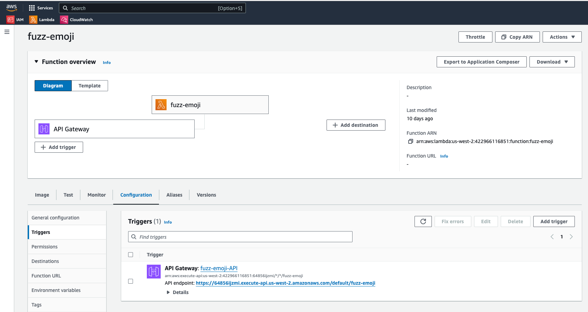

# Overview

This directory contains files and scripts to update the fuzz-emoji lambda function.

# Pre-requisites

- An AWS account with a profile called `rivate`
- aws CLI

# The AWS lambda function

The AWS lambda function was created using click-ops in the AWS console with a Gateway API HTTP
trigger.

# Create ECR repo

Do this one time.

```
account=$(aws sts get-caller-identity --query Account --output text --profile private)
aws ecr get-login-password --profile private | docker login     \
  --username AWS                                                \
  --password-stdin "${account}.dkr.ecr.us-west-2.amazonaws.com"

aws ecr create-repository --repository-name fuzz-emoji \
  --profile private                                    \
  --image-scanning-configuration scanOnPush=true       \
  --image-tag-mutability MUTABLE
```

# Update function

Whenever you update the code run this command:

```
./update.sh
```

# Test locally

```
docker run --platform linux/arm64 -p 9000:8080 fuzz-emoji:latest lambda_function.handler
```

Then, using httpie and jq

```shell
http POST http://localhost:9000/2015-03-31/functions/function/invocations \
    descriptions:='["flame", "Israel", "confused"]' | jq -r '.body | fromjson'
{
  "flame": "('fire', '🔥')",
  "confused": "('confused_face', '😕')"
}
```

# Testing the lambda function

Your lambda function should like so in the AWS console:



Now, you can test it using the API gateway endpoint via httpie and jq again:

```shell
http POST https://64856ijzmi.execute-api.us-west-2.amazonaws.com/default/fuzz-emoji \
    descriptions:='["flame", "confused"]' | jq -r

{
  "flame": "('fire', '🔥')",
  "confused": "('confused_face', '😕')"
}    
```
